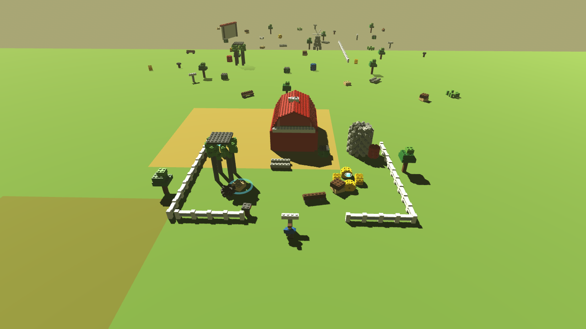

# Playtest: one full round, measured against LEGO Indiana Jones

**Date:** 2026-09-08 · **Build:** `294a53d` · **Method:** 150-second autopilot
round, every player-facing event timestamped (`--playthrough`,
`[BS:QA:PLAYTHROUGH]`). Raw log: `Docs/playthrough-2026-09-08.log`.

**Caveat, stated first:** the autopilot is not a player. It never hesitates,
explores, backtracks or gets bored. Its numbers are an **upper bound on event
density** and a **lower bound on dead time**. A human would score worse on both.

---

## The round, in numbers

| | |
|---|---|
| Duration | 150 s |
| Final score | 4,159 studs |
| Bricks torn | 507 |
| Phase reached | BUILD (2 of 5) — never completed |
| TRUE CHASER earned at | **t ≈ 7 s** |
| BUILD unlocked at | **t = 6.95 s** |
| Longest silence | **14.3 s** (from t = 88.9) |

| Event | Count | Per minute |
|---|---|---|
| STUD | 369 | 147.5 |
| RAM | 8 | 3.2 |
| SMASH | 7 | 2.8 |
| TUMBLE | 6 | 2.4 |
| GAG | 3 | 1.2 |
| PHASE | 1 | 0.4 |
| RATING | 1 | 0.4 |

---

## Six findings

### 1. The level eats itself

507 bricks torn. By **t ≈ 90 s the map is bare** — see
`Docs/shots/06-empty-map-t108.png`: one outhouse, a fence, two trucks, and a
hundred metres of empty grass. The remaining 60 seconds have nothing in them.

A LEGO Indiana Jones level is a **hand-authored set you travel through**, gated
into sections, with fresh scenery arriving as you progress. It cannot be
exhausted, because you are moving through it rather than standing in an arena
while it is consumed.

Ours is an arena, and the tornado empties it. **This is the single biggest
structural difference**, and it is upstream of everything else in this list.

### 2. Progression is over in seven seconds

BUILD unlocks at t = 6.95 s. TRUE CHASER — the level's top rating — is earned at
t ≈ 7 s, before a player has finished learning the controls.

In LEGO Indy, True Adventurer is calibrated across a 15–30 minute level and is
typically reached near the end of a thorough run. The threshold's job is to stay
*just* out of reach so it pulls you through the whole level.

`TRUE_CHASER = 1400` against an observed rate of ~4,400 studs/minute is roughly
**twenty to thirty times too low**. `STUD_GOAL = 400` for the build gate is worse.

### 3. The event mix is inverted

369 stud pickups against **15 player-verb events** (7 smashes, 8 rams). Roughly
**96% of everything that happens to the player is passive collection.**

The LEGO games are the other way round: the loop is *you smash a thing → studs
come out → you smash the next thing*. Studs are the **consequence** of acting.
Here they are the activity, and the player is a vacuum cleaner standing near a
fan.

### 4. There is only one denomination

Every payout in the log is +10, +20 or +30 — base ten times the band multiplier.
369 near-identical events.

LEGO Indy has **silver 10 / gold 100 / blue 1,000 / purple 10,000**. Finding a
big one is a small event in itself, and the varying pitch and value make the
stud stream feel like it has texture. Ours is flat: no jackpots, no surprises,
nothing worth crossing a room for.

### 5. Fourteen seconds of nothing

The longest gap with zero player-facing feedback is 14.3 s, and the whole back
half of the round is sparse (buckets at t=30, 40, 120, 140 are nearly empty).

In a LEGO game you are essentially never without feedback, because **everything
is smashable**. Idle time does not exist — if there is nothing to do, you hit a
bench and studs come out. Our world has too few objects to support that.

### 6. The objective chain is one link long

The round never advanced past BUILD. There is one goal; when it stalls, there is
no second thing to be doing.

LEGO Indy runs a near-continuous chain: ability gate → build → set piece →
hazard → gate. Something is always both available and blocked, which is what
gives a level its shape.

---

## What LEGO Indy has that we have not built at all

- **Minikits** (10 per level) — the exploration layer. No equivalent exists, so
  there is no reason to leave the funnel.
- **Free Play** — the second pass with the full roster. Nothing is currently
  placed to be unreachable-then-reachable.
- **Enemies and hazards** as continuous low-stakes interaction.
- **Cutscene gags** bookending the level.
- **A hub** to spend studs in. Ours are earned and then nothing happens to them.

---

## Recommended order of work

Ranked by how much each closes the gap, not by effort:

1. **Stop the level consuming itself.** Either make the world far larger and
   denser and move the player through it, or have the funnel travel a route with
   fresh set-pieces ahead of it. Everything else is cosmetic until an arena stops
   being empty at 90 seconds.
2. **Recalibrate the economy.** `TRUE_CHASER` up by 10–20×; gate BUILD on
   reaching a place or completing an act, not on a stud count that trips in
   seconds.
3. **Make everything smashable.** Fences, mailboxes, bins, crops, signs — the
   cheap furniture that removes dead time and makes SMASH the default verb.
4. **Add stud denominations** so payouts have texture and jackpots exist.
5. **Build the sensor-ball collectible layer** — the minikit slot the design
   already specifies.
6. **Chain the objectives** so something is always available and something is
   always blocked.

Items 1 and 3 together are the honest answer to "it doesn't identify as a
classic LEGO game". The art pass helped; the *structure* is the gap.

---

# Follow-up: the corridor rebuild (same day)

Findings 1 and 3 were implemented together, because they turned out to be one
problem: the level emptied not because the world was small but because the storm
**looped a small arena**, re-crossing ground it had already eaten.

## What changed

- **The world streams.** Blocks of scenery spawn ahead of the storm and are
  reclaimed behind it (`[BS:WORLD:STREAM]`). The storm now travels a corridor
  instead of orbiting. Live object count is bounded no matter how long the round
  runs.
- **Eleven new smashable props** — mailboxes, bins, crates, hay bales, signs,
  benches, barrels, troughs, crops, tyre stacks — scattered ~11 per block.
- **Economy retuned**: `TRUE_CHASER` 1,400 → 9,000, `STUD_GOAL` 400 → 3,500.
- **Structures batched** into two MultiMesh draw calls each instead of two per
  brick (`[BS:DESTRUCTION:STRUCTURE]`).
- **Hot loops cached** (`[BS:WORLD:NEAR_CACHE]`) so per-frame work no longer
  walks every structure in the corridor.

## Measured, against the same 200 s harness

| | Before (arena) | After (corridor) |
|---|---|---|
| SMASH / min | 2.8 | **6.3** |
| Longest silence | **14.3 s** | **7.7 s** |
| TRUE CHASER earned | **t ≈ 7 s** | not in 200 s |
| BUILD unlocked | t = 6.95 s | not in 200 s |
| Map state at end | **bare at t≈90 s** | 133 live structures, 600 m travelled |
| Activity distribution | all in first bucket | every bucket populated |

The structural problem is fixed. The level no longer consumes itself, smashing
roughly doubled, and dead time roughly halved.

## Two things now over-corrected

`TRUE_CHASER = 9,000` was not reached in 200 s (the autopilot banked ~2,000), and
`STUD_GOAL = 3,500` means BUILD never unlocked either, so the objective chain was
never exercised in this run. Both were tuned against the *old* stud rate and the
new world pays out differently. They need one more calibration pass against a
human run, not an autopilot one.

## Performance: unresolved, and unmeasurable here

The round reports **9 fps average**. Three separate optimisations moved it
essentially not at all:

1. MultiMesh batching (draw calls cut by roughly an order of magnitude) — no change.
2. Caching the per-frame structure loops — no change.
3. Rendering at one-eighth the pixels (1280×720 → 480×270) — 10 fps → 12 fps.

Three independent changes with no effect, including a resolution cut, is strong
evidence that **the bottleneck is the software renderer in this container**
(llvmpipe under Xvfb), not the game. There is no GPU here.

The honest conclusion is that **frame rate cannot be measured in this
environment**, and the 9 fps figure should not be read as a device number in
either direction. The batching and caching are still correct — they demonstrably
reduce draw calls and per-frame iteration — but their benefit is unproven.

This is exactly what `Docs/NO_DRIFT_POLICY.md` means by the device being the
final authority. The next real performance datapoint has to come from the APK on
hardware.

---

# Follow-up 2: the hand-authored set piece

The last finding was that density is not intent — a procedurally scattered
corridor reads as *a field with objects in it* rather than *a place*. THE HOG LOT
(`[BS:CONTENT:HOG_LOT]`) is the test of that claim: one yard, every object placed
by hand, in relation to the others.

## What it contains

A fenced farmyard with one entrance and a barn closing the far side, and three
collectibles that each teach a **different verb**:

| Sensor ball | Where | Teaches |
|---|---|---|
| 1 | buried in the haystack, just inside the entrance | **SMASH** |
| 2 | on top of the water tower | **BUILD** the steps, then **JUMP** |
| 3 | in the alcove behind a collapsed silo | **SWAP** to Bill |

Plus the gag: a cow on the barn roof. Absurd on sight; when the barn goes it
lands, complains, and is completely fine — which is North Star Law 1 told as a
joke rather than stated as a rule.

## Three systems the game did not have before

- **An ability gate.** `Structure.heavy` resists Jo *and the funnel*. A gate the
  weather solves is not a gate. This is currently the only thing making the
  character swap matter.
- **A collectible layer.** The first collectibles in the project. All three pays
  25,000 studs — deliberately more than a whole round of looting, following the
  TT lesson that exploration must loudly out-earn grinding.
- **A build that is a puzzle solution**, not an objective marker: the steps are
  *how you reach* ball 2.

## Verified

`--selftest` asserts each independently: the storm cannot shift the gate, Jo
cannot shift the gate, Bill can (44 bricks), all three balls are collectable, and
the bonus pays. Measured on the landing commit: `sensors=3/3 gate_torn=44`.

## What building it taught

Two things worth recording:

1. **Authored ground has to be reserved.** The first capture had a procedural
   windmill standing in the middle of the yard — the streaming generator does not
   know the difference between empty ground and composed ground. Set-piece
   regions are now excluded from streaming.
2. **The composition reads immediately.** Side by side with the scattered blocks
   beyond its fence, the yard looks like somewhere a person decided things should
   go. That is the difference the last playtest could only assert.

## Honest limit

It has not been played. The pacing claim — that this is roughly sixty seconds of
deliberate beats — is a design intention verified only by assertions, not by a
human moving through it. That is the next thing to check.
