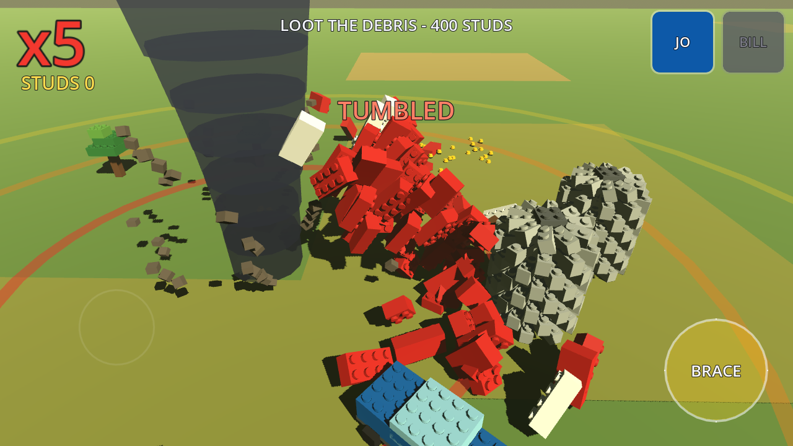
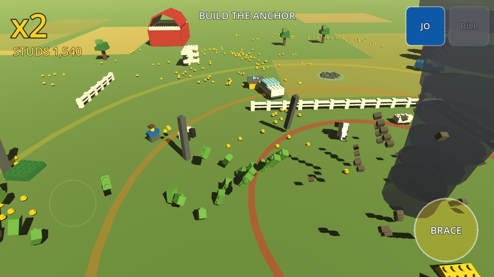

# BRICKSTORM

**A LEGO-formula action game built on *Twister* (1996).**
Godot 4.6 · mobile-first · Android landscape.

> The LEGO games let you smash the world.
> **BRICKSTORM makes the tornado smash it — and pays you to loot the debris while it's still moving.**

Full design in **[`Docs/GAME_CONCEPT.md`](Docs/GAME_CONCEPT.md)**.



---

## The idea in one paragraph

*Twister* is a chase movie about getting closer to the dangerous thing on purpose,
which is a risk/reward economy sitting in plain sight. So the funnel is not an
enemy — it is a moving, screaming resource node. It wanders the level in real
time, converts scenery into flying bricks, and those bricks become studs. **Studs
are worth more the closer to the funnel you collect them.** The multiplier on the
HUD is the movie's entire thesis in one UI element.

| Band | Distance | Multiplier |
|---|---|---|
| GREEN | outside 34m | ×1 |
| YELLOW | 34m | ×2 |
| ORANGE | 22m | ×3 |
| RED | 12m | ×5 — only Bill can stand here |

## Two design laws

1. **Nothing that moves is ever destroyed.** Minifigs, cows, dogs. They get
   lifted, spun, flung and landed — never damaged, never removed. Only *scenery*
   comes apart. This is what makes a tornado game joyful instead of grim.
2. **There is no fail state, only a toll.** Get caught and you are carried up,
   spun and dropped, minus a fraction of your studs — which scatter and can be
   re-collected. No game over, no lives, no retry screen.

## What is playable right now

A vertical slice, running, not a mockup:

- a funnel that dismantles a farm town **in real time** into physics debris
- distance-scaled stud value with the risk bands drawn on the ground
- wind pressure and **BRACE** — so standing close is a decision, not a formality
- **Jo** (READ THE SKY, wide magnet) and **Bill** (walks the RED band, smashes scenery)
- a build spot, an anchor, and a **DOROTHY** deployment to close the loop
- one-stick + one-context-button touch control, landscape

Verified by `--selftest`: 219 bricks torn, 72 in flight, 1,810 studs banked with
multipliers applied, phase advanced. Screenshots in `Docs/shots/` are captures
from an actual run, not concept art.



## Controls

| | |
|---|---|
| **Left thumb** | floating virtual stick — appears where your thumb lands |
| **Right thumb** | one context button: **SMASH · BUILD · GRAB · BRACE** (label changes live) |
| **Double-tap context** | character ability |
| **Portrait tap** | swap character |
| **Camera** | auto-framed. There is no camera control, by design. |

Desktop fallback: `WASD` / arrows to move.

## Running it

```bash
# open in the editor
godot --path .

# play it
godot --path . --rendering-driver opengl3

# headless check that the core loop actually works
godot --headless --path . -- --selftest

# autopilot demo + screenshot capture to /home/user/brickstorm_shots
godot --path . --rendering-driver opengl3 -- --capture
```

Requires Godot **4.7.2** (also imports and passes `--selftest` unchanged on 4.6). No addons, no external assets — every brick is generated
from code, so there is nothing to import.

## Builds

`.github/workflows/build.yml` produces, on every push:

- **Web** (`gl_compatibility`, no threads, so it runs on GitHub Pages as-is)
- **Android APK** (arm64, landscape-locked, debug-signed)

Both land as workflow artifacts. The Android SDK is unreachable from the
development container used to write this, so the APK is built in CI rather than
locally — the web export is the fast playtest path.

## Source map

| File | What it owns |
|---|---|
| `scripts/brick_lib.gd` | brick/stud/minifig construction at real stud pitch, palette |
| `scripts/prop_builder.gd` | the farm town — barn, farmhouse, silo, water tower, windmill, drive-in |
| `scripts/structure.gd` | destructible structures: cheap visuals until torn, rigid bodies after |
| `scripts/tornado.gd` | the funnel — path, wind field, risk bands, debris vortex |
| `scripts/player.gd` | two characters, brace, tumble, carry |
| `scripts/stud_field.gd` | loose studs, magnet, collection value |
| `scripts/hud.gd`, `virtual_stick.gd` | the two-thumb control scheme |
| `scripts/main.gd` | world assembly, phases, camera, scoring |

### Two things worth knowing before editing

- **Untorn bricks are not physics bodies.** A structure is cheap visual meshes
  under one static collider; a brick only becomes a `RigidBody3D` at the moment
  it is torn loose. Hundreds of frozen rigid bodies would eat a phone alive.
- **Vortex forces are accelerations, not forces** — the mass factor cancels in
  `Tornado._drag_in`. Anything much above gravity throws bricks clean off the map,
  and then the loot never piles up where the player is. That bug cost a debugging
  pass; the current values are tuned to make debris *orbit*.

## Known gaps

- Studs are capped at 240 with oldest-first recycling; a real build wants pooling.
- ~450 visual bricks ≈ 900 draw calls. Fine on desktop, needs per-structure
  MultiMesh batching before it ships to a phone.
- No audio. No sensor-ball collectibles yet. One level, not seven.
- Dorothy's deployment is a single beat, not the escalating version in §6.

## Repository conventions

`main` is intentionally neutral so independent implementations can coexist
without overwriting one another (see the README on `main`).

- `openai/brickstorm` — the ChatGPT/OpenAI implementation.
- `claude/lego-twister-mobile-game-3a8ypy` — **this branch**, the Claude implementation.

This branch does not touch `openai/*` and has not been merged into `main`.
Details in [`CLAUDE_WORKSTREAM.md`](CLAUDE_WORKSTREAM.md).

## Naming

*LEGO* and *Twister* are trademarks of the LEGO Group and Warner Bros.
respectively. This is an unlicensed prototype built as a design exercise;
**BRICKSTORM** is a working title and the character and level names are
placeholders. They should be replaced before this is published anywhere.
